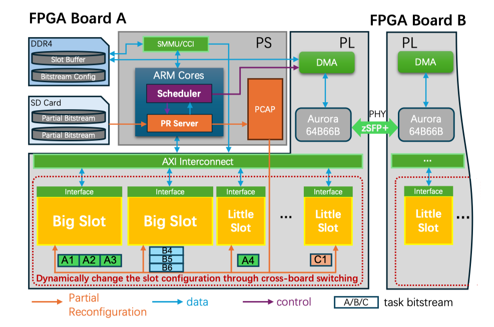

## VersaSlot: Efficient Fine-grained FPGA Sharing with Big.Little Slots and Live Migration in FPGA Cluster




VersaSlot, an efficient spatio-temporal FPGA sharing system with novel Big.Little slot architecture that can effectively resolve the contention and task blocking while improving resource utilization. For the heterogeneous Big.Little architecture, we introduce an efficient slot allocation and scheduling algorithm, along with a seamless cross-board switching and live migration mechanism, to maximize FPGA multiplexing across the cluster. We evaluate the VersaSlot system on an FPGA cluster composed of the latest Xilinx UltraScale+ FPGAs (ZCU216) and compare its performance against four existing scheduling algorithms. The results demonstrate that VersaSlot achieves up to 13.66x lower average response time than the traditional temporal FPGA multiplexing, and up to 2.19x average response time improvement over the state-of-the-art spatio-temporal sharing systems. Furthermore, VersaSlot enhances the LUT and FF resource utilization by 35% and 29% on average, respectively.


### Code Structure

- `HLS_Code` contains the implementation of the benchmark applications and tasks, which can be synthesized into IP cores using Vitis HLS. To enable parital reconfigurable, the generated IP cores must share identical PHY interfaces and bit widths. Furthermore, it is better to synthesize these functions within the same source file (i.e., main.cpp) and functions can be appended when new application are added without repeatedly generating old IP cores.

- `Block_Design` contains automation scripts for VersaSlot designs. Vivado can import these TCL scripts to automatically construct the design. The .XSA file is the design export from Vivado, used for configuration within the Vitis integrated development environment.

- `Vitis_Scheduler` includes the implementations of the Big.Little (VersaSlot_BL) and Only.Little (VersaSlot_OL) schedulers and PR servers. It also incorporates the implementations of several comparison approaches or system, such as Only time multiplexing (Baseline), First-Come-First-Serve (FCFS), Round-Robin, and Nimblock.


## Citation
If you use VersaSlot for your research, please cite our paper [paper](https://ieeexplore.ieee.org/document/11132514):
```
@INPROCEEDINGS{11132514,
  author={Gu, Jianfeng and Wang, Hao and Guo, Xiaorang and Schulz, Martin and Gerndt, Michael},
  booktitle={2025 62nd ACM/IEEE Design Automation Conference (DAC)}, 
  title={VersaSlot: Efficient Fine-grained FPGA Sharing with Big.Little Slots and Live Migration in FPGA Cluster}, 
  year={2025},
  volume={},
  number={},
  pages={1-7},
  keywords={Multiplexing;Data centers;Design automation;Scheduling algorithms;Computer architecture;Switches;Table lookup;Resource management;Time factors;Field programmable gate arrays},
  doi={10.1109/DAC63849.2025.11132514}}
```


## License
Copyright 2024 VersaSlot Authors, KontonGu (**Jianfeng Gu**), Hao Wang, et. al.
@Techinical University of Munich, **CAPS Cloud Team**

Licensed under the Apache License, Version 2.0 (the "License");
you may not use this file except in compliance with the License.
You may obtain a copy of the License at

    http://www.apache.org/licenses/LICENSE-2.0

Unless required by applicable law or agreed to in writing, software
distributed under the License is distributed on an "AS IS" BASIS,
WITHOUT WARRANTIES OR CONDITIONS OF ANY KIND, either express or implied.
See the License for the specific language governing permissions and
limitations under the License.